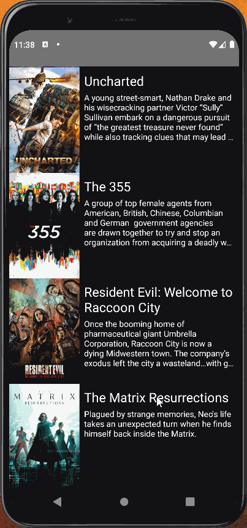
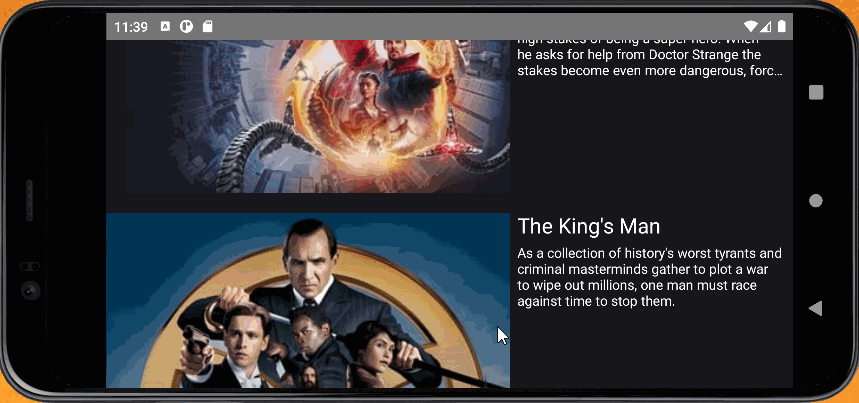

# Unit 1 Project - Flixster - Part 1

Flixster is a simple app that displays an image, title, and description of movies currently playing in theaters. Utilizes the Movie Database API for generating 
movie data. Supports both landscape and portait modes.

Submitted by: Xiuzhu Shao

## User Stories

The following **required** functionality is completed:

* [X] User can **view a list of movies** (title, poster image, and overview) currently playing in theaters from the Movie Database API.

The following **optional** features are implemented:

* [X] Views should be responsive for both landscape/portrait mode
* [X] Improve the user interface through styling and coloring (Implemented dark background and light text)

## Video Walkthrough

Here's a walkthrough of implemented user stories:

Portrait

Landscape

GIFs created with [LiceCap](http://www.cockos.com/licecap/).
